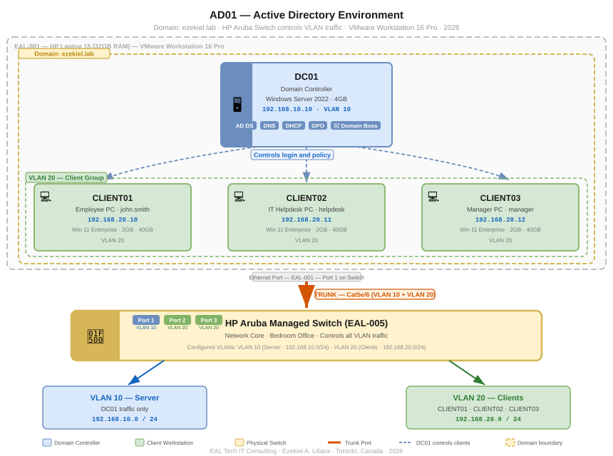

# AD01 — Active Directory Home Lab

**Windows Server 2022 · Active Directory · VMware · ezekiel.lab · Purple Team**

Hi,

In this hands-on project I build and document a complete Active Directory environment inside my home lab. The goal is to simulate what a real company network looks like — where a Domain Controller manages all users and computers, IT controls who has access to what, and three different employees log in from their own workstations every day.

This is **Phase 2** of my full EAL Tech SOC Home Lab. The Active Directory environment is the foundation that everything else in the lab is built on — Wazuh monitors it, Kali attacks it, and I investigate and defend it.

---

## Table of Contents

1. [Project Overview](#project-overview)
2. [Environment](#environment)
3. [Network Diagram](#network-diagram)
4. [How Active Directory Works](#how-active-directory-works)
5. [What Was Built](#what-was-built)
6. [Phase 1 — Domain Controller Setup](#phase-1--domain-controller-setup-dc01)
7. [Phase 2 — Windows 11 Client Setup](#phase-2--windows-11-client-setup)
8. [Phase 3 — Group Policy and Users](#phase-3--group-policy-and-users)
9. [Errors and Troubleshooting](#errors-and-troubleshooting)
10. [Key Concepts Demonstrated](#key-concepts-demonstrated)
11. [Tools and Technologies](#tools-and-technologies)
12. [Project Status](#project-status)

---

## Project Overview

The goal of this project is to simulate what it looks like inside a real company that runs an on-premises Active Directory environment.

In a real company — when an employee turns on their computer, logs in, and gets access to only the files and folders they are allowed to see — Active Directory is making all of that happen behind the scenes. The Domain Controller is the brain. The clients are the employee computers. Group Policy is the rulebook.

I built exactly that — a Domain Controller (DC01) running on Windows Server 2022, and three client workstations (CLIENT01, CLIENT02, CLIENT03) running Windows 11 Enterprise, all joined to the domain **ezekiel.lab** and controlled through my HP Aruba managed switch.

This lab gives me hands-on experience with the exact technology a SOC Analyst encounters on their first day at a Canadian company.

---

## Environment

### Physical Hardware

| Asset ID | Device | RAM | Role |
|---|---|---|---|
| EAL-001 | HP Laptop 15 | 32GB | Blue Team Host — runs all Windows VMs |
| EAL-005 | HP Aruba Managed Switch | — | Network Core — controls all VLAN traffic |

### Virtual Machines

| VM ID | VM Name | OS | RAM | IP Address | VLAN | Role |
|---|---|---|---|---|---|---|
| VM-001 | DC01 | Windows Server 2022 | 4GB | 192.168.10.10 | VLAN 10 | Domain Controller |
| VM-002 | CLIENT01 | Windows 11 Enterprise | 2GB | 192.168.20.10 | VLAN 20 | Employee PC |
| VM-003 | CLIENT02 | Windows 11 Enterprise | 2GB | 192.168.20.11 | VLAN 20 | IT Helpdesk PC |
| VM-004 | CLIENT03 | Windows 11 Enterprise | 2GB | 192.168.20.12 | VLAN 20 | Manager PC |

### Domain Information

| Setting | Value |
|---|---|
| Domain Name | ezekiel.lab |
| Domain Controller | DC01 |
| DC IP Address | 192.168.10.10 |
| DNS Server | 192.168.10.10 |
| DHCP Server | 192.168.10.10 |
| DHCP Scope | 192.168.20.100 — 192.168.20.200 |

### Network Design

| VLAN | Name | Devices | Purpose |
|---|---|---|---|
| VLAN 10 | Server | DC01 | Active Directory, DNS, DHCP |
| VLAN 20 | Clients | CLIENT01, CLIENT02, CLIENT03 | Employee workstations joined to domain |

### How the Network Works

All four VMs run inside VMware on EAL-001. One ethernet cable (trunk port) carries VLAN 10 and VLAN 20 traffic from the HP Laptop down to the HP Aruba Switch. The switch reads the VLAN tag and controls where each VM's traffic goes — just like a real enterprise network.

---

## Network Diagram



---

## How Active Directory Works

Think of Active Directory like the **security desk at a large office building.**

When John Smith walks in and says "I work in IT" — the security desk checks the list. If his name is there and his badge is valid — he gets access to the right floors only. A manager gets access to management areas. The helpdesk gets access to IT areas.

Active Directory does exactly this for every computer and user on the network — automatically, every time someone logs in.

### The Login Flow

```
1. CLIENT01 turns on -- john.smith types username and password
         |
2. CLIENT01 sends the login request to DC01 at 192.168.10.10
         |
3. DC01 checks the Active Directory database
         |
4. Username and password match -- LOGIN APPROVED
         |
5. DC01 sends Group Policy rules to CLIENT01
         |
6. john.smith is now logged in with the correct access level
```

### Key Terms

| Term | Simple Meaning |
|---|---|
| Domain Controller (DC) | The main server that controls everything — this is DC01 |
| Active Directory (AD) | The database of all users and computers on the network |
| Domain | The name of the network — ezekiel.lab |
| Group Policy (GPO) | Rules the DC sends to all computers automatically |
| DNS | Translates computer names to IP addresses |
| DHCP | Automatically gives IP addresses to computers that join |
| OU (Organisational Unit) | Folders inside AD — IT, Management, Employees |

---

## What Was Built

- [x] Full lab documentation V2
- [x] Network diagram AD01
- [ ] Download Windows Server 2022 ISO
- [ ] Create DC01 VM in VMware Workstation 16 Pro
- [ ] Install Windows Server 2022 on DC01
- [ ] Set static IP 192.168.10.10
- [ ] Install Active Directory Domain Services
- [ ] Promote DC01 to Domain Controller
- [ ] Create domain ezekiel.lab
- [ ] Configure DNS on DC01
- [ ] Configure DHCP on DC01
- [ ] Create Organisational Units — IT, Management, Employees
- [ ] Create user accounts — john.smith, helpdesk, manager
- [ ] Create and apply Group Policy Objects
- [ ] Configure trunk port on HP Aruba Switch
- [ ] Install CLIENT01 Windows 11 Enterprise
- [ ] Install CLIENT02 Windows 11 Enterprise
- [ ] Install CLIENT03 Windows 11 Enterprise
- [ ] Join all three clients to ezekiel.lab domain
- [ ] Test login with all three users
- [ ] Verify Group Policy is applying correctly

---

## Phase 1 — Domain Controller Setup (DC01)

| Step | Task | Status |
|---|---|---|
| 1 | Download Windows Server 2022 ISO | ✅ Downloading |
| 2 | Create DC01 VM in VMware | ⏳ To Do |
| 3 | Install Windows Server 2022 | ⏳ To Do |
| 4 | Set static IP 192.168.10.10 | ⏳ To Do |
| 5 | Install AD DS role | ⏳ To Do |
| 6 | Promote to Domain Controller | ⏳ To Do |
| 7 | Create domain ezekiel.lab | ⏳ To Do |
| 8 | Configure DNS and DHCP | ⏳ To Do |
| 9 | Create OUs and user accounts | ⏳ To Do |
| 10 | Create Group Policies | ⏳ To Do |

---

## Phase 2 — Windows 11 Client Setup

| VM | Username | Role | IP Address | Status |
|---|---|---|---|---|
| CLIENT01 | john.smith | Regular Employee | 192.168.20.10 | ⏳ To Do |
| CLIENT02 | helpdesk | IT Helpdesk | 192.168.20.11 | ⏳ To Do |
| CLIENT03 | manager | Manager | 192.168.20.12 | ⏳ To Do |

---

## Phase 3 — Group Policy and Users

| Policy | What It Does | Applied To |
|---|---|---|
| Password Policy | Minimum 12 characters, complexity required | All users |
| Screen Lock | Lock screen after 5 minutes idle | All clients |
| Account Lockout | Lock after 5 failed login attempts | All users |
| Restricted Access | Employees cannot access management folders | CLIENT01 |

---

## Errors and Troubleshooting

| Date | Error | Cause | Fix |
|---|---|---|---|
| — | Updated as build progresses | — | — |

---

## Key Concepts Demonstrated

- **Active Directory deployment** — Domain Controller, DNS, DHCP, Organisational Units
- **User and computer management** — creating accounts, groups, and applying policies
- **Group Policy** — enforcing security rules across all workstations from one place
- **VLAN network design** — separating server and client traffic through a physical switch
- **Trunk port configuration** — one cable carrying multiple VLANs from VMware to switch
- **Domain join process** — connecting Windows 11 clients to Active Directory
- **Enterprise login flow** — understanding authentication in a real company

---

## Tools and Technologies

| Tool | Version | Purpose |
|---|---|---|
| VMware Workstation | 16 Pro | Runs all virtual machines |
| Windows Server 2022 | Evaluation 180 days | Domain Controller OS |
| Windows 11 Enterprise | Evaluation 90 days | Client workstation OS |
| HP Aruba Switch | Managed | VLAN segmentation and trunk port |
| Active Directory Domain Services | Built into Server 2022 | User and computer management |
| DNS | Built into Server 2022 | Name resolution for ezekiel.lab |
| DHCP | Built into Server 2022 | Automatic IP assignment |
| Group Policy | Built into Server 2022 | Security policy enforcement |

---

## Project Status

| Component | Status |
|---|---|
| Lab Documentation V2 | ✅ Complete |
| Network Diagram | ✅ Complete |
| DC01 — Domain Controller | 🔄 In Progress |
| CLIENT01 — Employee PC | ⏳ To Do |
| CLIENT02 — IT Helpdesk PC | ⏳ To Do |
| CLIENT03 — Manager PC | ⏳ To Do |
| Group Policy Configuration | ⏳ To Do |
| Domain Join — All Clients | ⏳ To Do |

---

*Part of the EAL Tech SOC Home Lab · EAL Tech IT Consulting · Ezekiel A. Libara · Toronto, Canada · 2026*
