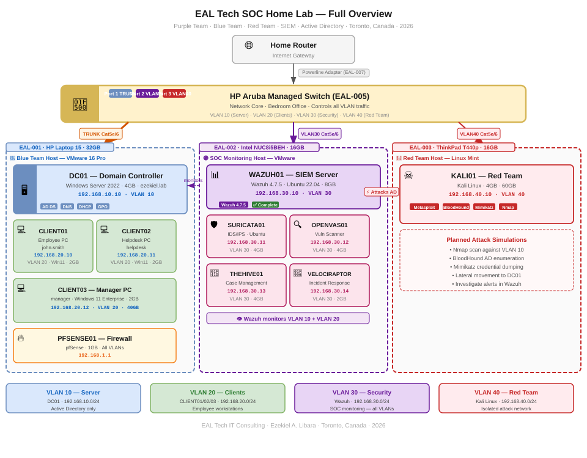

# EAL Tech SOC Home Lab

**Windows Server 2022 · Active Directory · Wazuh · Kali Linux · VMware · Purple Team**

Hi,

I am Ezekiel Libara, a SOC Analyst in training based in Toronto, Canada. This repository documents my complete hands-on SOC home lab — built to simulate a real enterprise IT and cybersecurity environment.

Every project in this lab mirrors what a real SOC Analyst does on the job — detecting threats, investigating alerts, responding to incidents, and understanding how attackers think.

This is a **Purple Team** environment. That means I run both sides:

- 🔵 **Blue Team** — I defend. I monitor, detect, and respond to threats using Wazuh SIEM.
- 🔴 **Red Team** — I attack. I simulate real attackers using Kali Linux and Metasploit.
- 🟣 **Purple Team** — Both sides work together to improve defences.

---

## Lab Overview

| Component | Detail |
|---|---|
| Blue Team Host | HP Laptop 15 — 32GB RAM — EAL-001 |
| SOC Monitoring Host | Intel NUC — 16GB RAM — EAL-002 |
| Red Team Host | ThinkPad T440p — 16GB RAM — EAL-003 |
| Network Core | HP Aruba Managed Switch — EAL-005 |
| Hypervisor | VMware Workstation 16 Pro |
| Domain | ezekiel.lab |

---

## Full Lab Diagram

---

## Projects

| Project | Description | Stack | Status |
|---|---|---|---|
| [WAZUH01 — Wazuh SIEM](./WAZUH01/README.md) | Deploy and configure Wazuh SIEM to detect and monitor threats across the home lab network | Wazuh · Ubuntu · VMware | ✅ Complete |
| [AD01 — Active Directory](./AD01/README.md) | Build a complete Active Directory domain with Domain Controller and 3 client workstations | Windows Server 2022 · VMware · ezekiel.lab | 🔄 In Progress |
| KALI01 — Red Team | Set up Kali Linux attack platform with Metasploit, BloodHound, and Mimikatz | Kali Linux · Metasploit · BloodHound | ⏳ Coming Soon |
| ATTACK01 — First Attack Simulation | Simulate a real attack against Active Directory and investigate the alert in Wazuh | Metasploit · Wazuh · TheHive | ⏳ Coming Soon |
| INCIDENT01 — First Incident Report | Document a full incident investigation from alert to resolution | Wazuh · TheHive · Markdown | ⏳ Coming Soon |

---

## Certifications

**Earned**
- CompTIA A+
- CompTIA Security+
- ISC2 Certified in Cybersecurity (CC)
- Google Cybersecurity Certificate

**In Progress**
- CCNA — Cisco

---

## Lab Documentation

| Document | Purpose |
|---|---|
| [EAL Tech SOC Home Lab Documentation V2](./EAL_Tech_SOC_HomeLab_Documentation_V2.pdf) | Full lab design — asset inventory, IP plan, VLAN plan, build order |
| [WAZUH01 Build Log](./WAZUH01/WAZUH01_Build_Log_May23_2026.pdf) | Full Wazuh installation documentation with screenshots |

---

## Connect

[LinkedIn](https://www.linkedin.com/in/ezekiellibara1982/)

---

*EAL Tech IT Consulting · Ezekiel A. Libara · Toronto, Canada · 2026*
